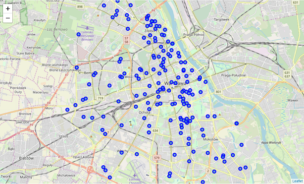
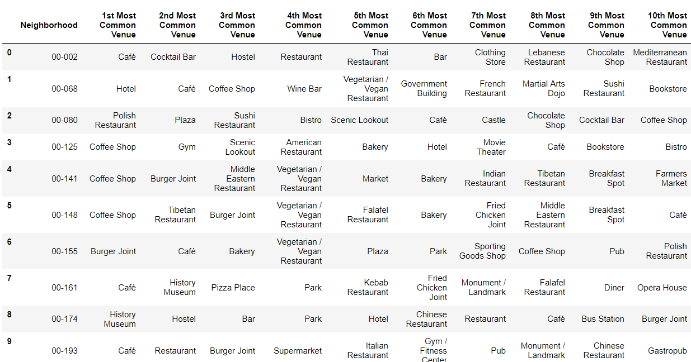

# Let's Get Started !

---
### **Introduction - business problem**

---
@title[Customize Slide Layout]
@snap[west span text-06]
@ul[spaced]
- Assume you are a global investor in field of gastronomy and you are looking to **open a chain of restaurants** in biggest cities in Europe. Many cities...

- Obviously you don not know every single city, and actually don't know **where to locate your restaurants**. Whether it's good idea to invest only in city centers, or maybe most of restaurants are hidden in some specific districts.

- The aim of this analysis if to **automatically find area of city with biggest density of restaurants and nightlife facilities using segmentation**. I'll be profiling districts of Warsaw (capital city of Poland) as a small prof of concept because I know the city and can verify whether findings from segmentation looks reasonable or not.
@ulend
@snapend

---

## Data used to solve the problem

---

@title[Customize Slide Layout]

@snap[west span-50]
##### Scrapped postal codes of Warsaw city
@snapend

@snap[east span-50]

@snapend

---

@title[Customize Slide Layout]

@snap[west span-50]
##### Foursqare location data via developers API
@snapend

@snap[east span-50]

@snapend

---

## Data preparation

---
@title[Customize Slide Layout]
@snap[west span-50  text-06]
@ul[spaced]
- Data obtained from Foursqare API - list of nearby venues with their categories).
- Used mainly Pandas to prepare data 
- Wrangle them, join, make one-hote encoding, aggregate
- Finally find most common venues in each district/postal code
@snapend
@ulend

@snap[east span-60]

@snapend

---

---?color=#E58537
@title[Add A Little Imagination]

@snap[north-west]
#### Add a splash of @color[cyan](**color**) and you are ready to start presenting...
@snapend

@snap[west span-55]
@ul[spaced text-white]
- You will be amazed
- What you can achieve
- *With a little imagination...*
- And **GitPitch Markdown**
@ulend
@snapend

@snap[east span-45]
@img[shadow](assets/img/conference.png)
@snapend

---?image=assets/img/presenter.jpg

@snap[north span-100 headline]
## Now It's Your Turn
@snapend

@snap[south span-100 text-06]
[Click here to jump straight into the interactive feature guides in the GitPitch Docs @fa[external-link]](https://gitpitch.com/docs/getting-started/tutorial/)
@snapend
