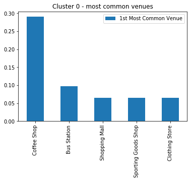

# Let's Get Started !

---?color=#E58537
### **Introduction - business problem**

---
@title[Customize Slide Layout]
@snap[west span text-06]
@ul[spaced]
- Assume you are a global investor in field of gastronomy and you are looking to **open a chain of restaurants** in biggest cities in Europe. Many cities...

- Obviously you don not know every single city, and actually don't know **where to locate your restaurants**. Whether it's good idea to invest only in city centers, or maybe most of restaurants are hidden in some specific districts.

- The aim of this analysis if to **automatically find area of city with biggest density of restaurants and nightlife facilities using segmentation**. I'll be profiling districts of Warsaw (capital city of Poland) as a small prof of concept because I know the city and can verify whether findings from segmentation looks reasonable or not.
@ulend
@snapend

---?color=#E58537

## Data used to solve the problem

---

@title[Customize Slide Layout]

@snap[west span-50]
##### Scrapped postal codes of Warsaw city
@snapend

@snap[east span-50]

@snapend

---

@title[Customize Slide Layout]

@snap[west span-50]
##### Foursqare location data via developers API
@snapend

@snap[east span-50]

@snapend

---?color=#E58537

## Data preparation

---
@title[Customize Slide Layout]
@snap[west span-50  text-06]
@ul[spaced]
- Data obtained from Foursqare API - list of nearby venues with their categories).
- Used mainly Pandas to prepare data 
- Wrangle them, join, make one-hote encoding, aggregate
- Finally find most common venues in each district/postal code
@snapend
@ulend

@snap[east span-50]

@snapend

---?color=#E58537

## Clustering - K-means

---

@title[Customize Slide Layout]

@snap[west span-50]

@snapend

@snap[east span-50  text-06]
@ul[spaced]
- Used K-means algorythym to find similar clusters - districts /(postal codes) 
- Similar to each other inside clusters, and differentas much as possible among clusters
- Profile each cluster and look at percentage of categories among 1st most common vanues
@snapend
@ulend

---?color=#E58537

## Results - findings!
---
@title[Customize Slide Layout]

@snap[west span-50]
Cluster 0 - busy places. Lots of people. Good for fastfood/snacks places like "Subway" or other "takeaway's".
@snapend

@snap[east span-50]

@snapend

---

@title[Customize Slide Layout]

@snap[west span-50]
Cluster 1 - best for restaurant. Mainly in downtown, but not always.
@snapend

@snap[east span-50]

@snapend

---

@title[Customize Slide Layout]

@snap[west span-50]
Cluster 6 - not in very city center, but good for sam cafe's, inexpensive food places. MIGHT BE BEST TO INVEST MONEY THERE!
@snapend

@snap[east span-50]

@snapend

---
* Cluster 2 - small one... Perhaps shoud be merged with some other cluster...
* Cluster 3/4/5 - remote districts. Good for pizza/burger, rather than elegant restaurant/drink bar.
* Cluster 7 - stores, gym, etc.
* Cluster 8 and 9 - recreation areas.

---?color=#E58537
@title[Add A Little Imagination]

#### Recommendations based on the results.

---

* Perhaps the most interesting cluster for investing money in food restauranst might by cluster no 6 - not in very city center (so not so pricy), but still with lot of gastro-venus and cafes!

* But also as a global investor we may think about some cheap/fastfood chain in places like in cluster no 0 - buzy places with lot of people.

* And if we want to open some posh-pricey elegant place, cluster no 1 would be the best.

---?color=#E58537

## THANKS FOR READING!
